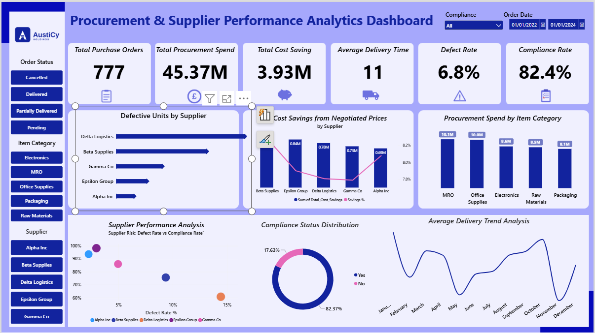
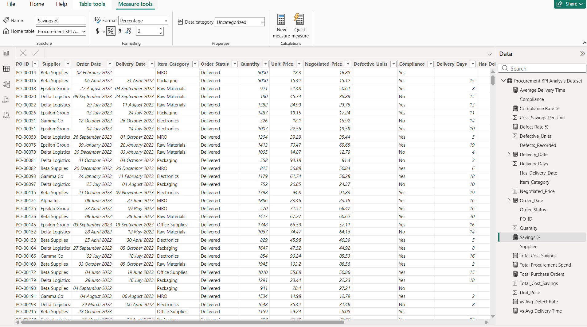
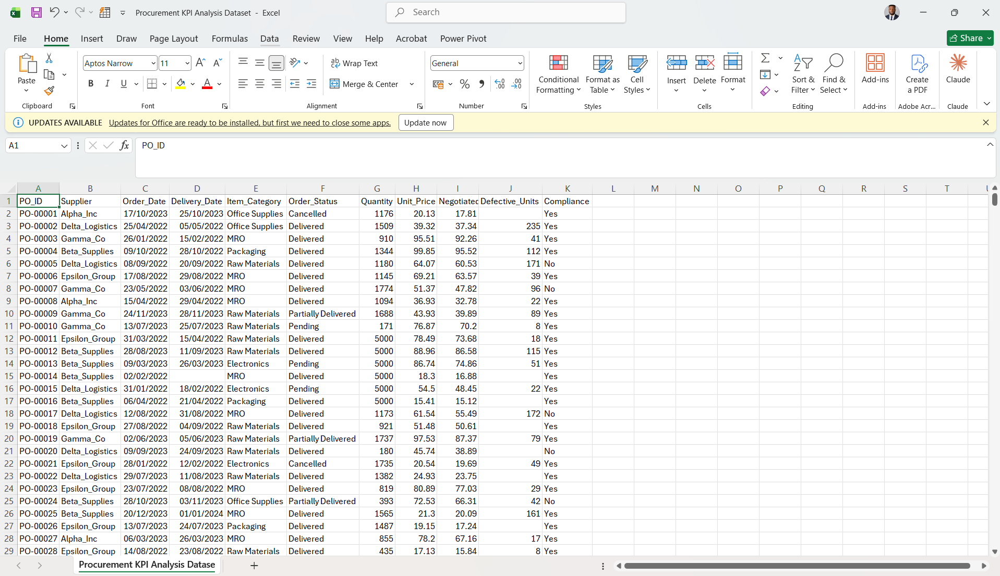

# 📦 Procurement & Supplier Performance Analytics Dashboard

## Table of Contents

- [Project Overview](#-project-overview)
- [Dashboard Preview](#-dashboard-preview)
- [Problem Statement](#-problem-statement)
- [Data Cleaning & Preparation](#-data-cleaning--preparation)
- [Exploratory Data Analysis](#-exploratory-data-analysis-eda)
- [Key Findings & Strategic Recommendations](#-key-findings--strategic-recommendations)
- [Tools & Techniques](#-tools--techniques)

---

## 📌 Project Overview

This project presents a **Procurement & Supplier Performance Analytics Dashboard**, built in Power BI, analyzing 777 purchase order records across five suppliers and five item categories.

The dashboard tracks spend, delivery performance, supplier compliance, and cost savings from negotiated pricing, transforming raw purchase order data into insights that support supplier management and procurement strategy decisions.

---

## Data Source

The raw data source used for this analysis is `Procurement KPI Analysis Dataset.csv`, containing 777 purchase order records across suppliers, item categories, pricing, delivery, and compliance fields.

[Download here](data/Procurement%20KPI%20Analysis%20Dataset.csv)

## 🖼 Dashboard Preview

*Interactive Power BI dashboard with slicers for Order Status, Item Category, Supplier, Compliance, and Order Date, showing Total Purchase Orders, Procurement Spend, Cost Savings, Average Delivery Time, Defect Rate, and Compliance Rate, alongside supplier and category breakdowns.*

---

## 🎯 Problem Statement

The analysis was designed to:

- Track overall procurement spend and cost savings from negotiated pricing.
- Evaluate supplier performance using **defect rate**, **compliance rate**, and **average delivery time**.
- Identify which suppliers pose the highest quality and compliance risk.
- Identify which item categories drive the most procurement spend.
- Provide data-driven recommendations to improve supplier reliability and reduce procurement risk.

---

## 🖌 Data Cleaning & Preparation

### Issues Identified

- Missing values in key fields, such as **Defective_Units** and **Delivery_Date** (particularly for Pending and Cancelled orders).
- Inconsistent supplier naming conventions between the raw dataset and reporting labels.
- Raw data required calculated fields not present in the source file.

### Steps Taken

- Loaded the dataset into **Power BI** and used **Power Query** to clean and shape the data.
- Handled missing values appropriately based on order status (e.g. no delivery date for orders not yet delivered).
- Built a dedicated **DAX measures table** (Procurement KPI Analysis) to keep all calculations in one place.
- Created key measures including:
  - **Total Purchase Orders**, **Total Procurement Spend**, **Total Cost Savings**
  - **Defect Rate %**, **Compliance Rate %**, **Savings %**
  - **Delivery Days**, **Average Delivery Time**, **Cost Savings Per Unit**
  - Benchmark measures such as **vs Avg Defect Rate** and **vs Avg Delivery Time**

---

## 🔍 Exploratory Data Analysis (EDA)

### Key Business Questions Explored

1. Which suppliers deliver the highest defect rates, and where is quality risk concentrated?
2. Which suppliers are non-compliant most often, and what is the overall compliance rate?
3. Which item categories account for the largest share of procurement spend?
4. How much cost saving is being achieved through negotiated pricing, and which suppliers negotiate best?
5. How does average delivery time trend over the year, and where are the delays concentrated?
6. Which suppliers combine high defect rates with low compliance, representing the greatest overall risk?

---

## 📈 Key Findings & Strategic Recommendations

### 1. 🏭 Category Spend Concentration

**Finding**
**MRO** ($10.1M) and **Office Supplies** ($10.0M) are the largest procurement spend categories, ahead of Electronics ($8.6M), Raw Materials ($8.5M), and Packaging ($8.1M).

**Recommendation**
- Prioritize contract renegotiation and supplier consolidation efforts on MRO and Office Supplies, where spend is highest.
- Explore volume-based discounts with top suppliers in these categories.

### 2. ⚠️ Supplier Quality Risk

**Finding**
**Delta Logistics** records the highest number of defective units of any supplier, followed by Beta Supplies and Gamma Co, while Alpha Inc has the lowest defect count. Overall defect rate across all orders is **6.8%**.

**Recommendation**
- Open a quality review with Delta Logistics and set a defect-rate improvement target.
- Increase incoming quality checks for high-defect suppliers.
- Use Alpha Inc's quality performance as an internal benchmark.

### 3. ✅ Compliance Gap

**Finding**
Overall compliance rate is **82.4%**, meaning roughly **1 in 6 orders (17.6%)** falls outside compliance requirements.

**Recommendation**
- Investigate root causes of non-compliance by supplier and item category.
- Introduce a compliance scorecard reviewed at each supplier check-in.
- Tie future order allocation to compliance performance.

### 4. 💰 Cost Savings from Negotiation

**Finding**
Negotiated pricing has delivered **$3.93M** in total cost savings. **Beta Supplies** delivers the strongest negotiated savings (~$0.84M, ~8.2%), while savings percentage trends lower across the remaining suppliers down to Alpha Inc (~$0.69M, ~7.8%).

**Recommendation**
- Share Beta Supplies' negotiation outcomes as a benchmark with the procurement team.
- Set minimum savings-percentage targets for supplier contract renewals.

### 5. 🚚 Delivery Time Trend

**Finding**
Average delivery time is **11 days** overall, but the monthly trend shows noticeable peaks and troughs across the year rather than a stable pattern.

**Recommendation**
- Investigate the operational or seasonal causes behind the delivery spikes.
- Set supplier-specific delivery SLAs for the months where delays are most frequent.
- Monitor delivery time alongside defect rate, since delays and quality issues may share root causes with the same suppliers.

---

## 💡 Overall Business Takeaway

The analysis shows that procurement spend, supplier quality, compliance, and delivery reliability are concentrated unevenly across suppliers, particularly around **Delta Logistics** on quality and the wider supplier base on compliance.

The business can reduce procurement risk and improve cost efficiency by **concentrating spend with reliable, compliant suppliers, addressing quality issues at the source, and using negotiation benchmarks like Beta Supplies to lift savings across the supplier base**.

---

## 🛠 Tools & Techniques

- **Power BI** — Data modeling, DAX measures, and dashboard visualization
- **Power Query** — Data cleaning and transformation
- **DAX** — Calculated measures (Defect Rate %, Compliance Rate %, Savings %, Delivery Days, etc.)
- **Microsoft Excel** — Source data inspection

